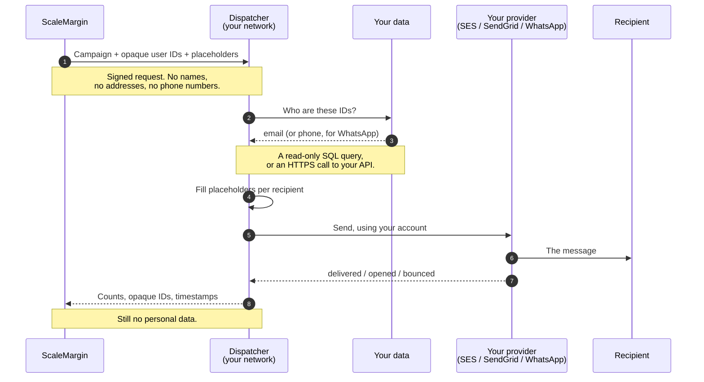

# Deploying the ScaleMargin Dispatcher

> 📦 **What you are installing** — one container that runs inside your infrastructure. ScaleMargin sends it campaigns containing placeholders and opaque user IDs; it resolves those into real people, personalizes each message, and sends through *your* provider account. No customer data ever reaches ScaleMargin.
>
> **What it takes** — two files, `docker-compose.yml` and `.env.yaml`, then `docker compose up -d`. About twenty minutes.

## Contents

- [1. How it works](#1-how-it-works)
  - [The shape of a send](#the-shape-of-a-send)
  - [Who holds what](#who-holds-what)
  - [The four things you configure](#the-four-things-you-configure)
- [2. Where the data lives — three options](#2-where-the-data-lives--three-options)
- [3. Before you start](#3-before-you-start)
- [4. Get the files](#4-get-the-files)
- [5. docker-compose.yml](#5-docker-composeyml)
- [6. .env.yaml](#6-envyaml)
  - [6.1 How the file is laid out](#61-how-the-file-is-laid-out)
  - [6.2 dispatcher: — this service](#62-dispatcher--this-service)
  - [6.3 scalemargin: — platform secrets](#63-scalemargin--platform-secrets)
  - [6.4 user_lookup: — where recipient data comes from](#64-user_lookup--where-recipient-data-comes-from)
  - [6.5 senders: and routing: — which accounts send](#65-senders-and-routing--which-accounts-send)
  - [6.6 links:, events:, storage: — optional](#66-links-events-storage--optional)
  - [6.7 env: — optional escape hatch](#67-env--optional-escape-hatch)
- [7. Samples](#7-samples)
  - [Sample A — Network mode](#sample-a--network-mode)
  - [Sample B — Host mode](#sample-b--host-mode)
- [8. Share with ScaleMargin, register webhooks](#8-share-with-scalemargin-register-webhooks)
  - [8.1 What to share with ScaleMargin](#81-what-to-share-with-scalemargin)
  - [8.2 Register provider webhooks](#82-register-provider-webhooks)
- [9. Start it and check](#9-start-it-and-check)
- [10. Day-two operations](#10-day-two-operations)
- [11. Troubleshooting](#11-troubleshooting)
- [12. Security summary](#12-security-summary)

---

# 1. How it works

Read this part even if you skip the rest. Most setup mistakes come from not knowing which system holds what.

## The shape of a send



## Who holds what

|  | Holds | Never holds |
| --- | --- | --- |
| **ScaleMargin** | Campaign copy, opaque user IDs, aggregate counts | Names, emails, phone numbers, message bodies |
| **The dispatcher** | Your provider keys, your lookup credentials, campaign history | Customer data at rest — it reads a record, sends, and forgets it |
| **You** | Everything about your customers | — |

## The four things you configure

1. **Where recipient data comes from** — a read-only database user, or an API you host. `user_lookup:`
2. **Which accounts send** — one account, or several with weights and failover. `senders:` and `routing:`
3. **How ScaleMargin reaches the dispatcher** — a shared key and a public URL. `dispatcher:`
4. **The dispatcher's own database** — created by the compose file; you set one password. `dispatcher.database:`

All four live in one file, `.env.yaml`. There is no `.env`.

---

# 2. Where the data lives — three options

This is the thing to get right. Recipients are resolved from **one of two sources you choose** — your API (network mode) or your database (database mode). Separately, the dispatcher always keeps **its own Postgres** for its working state.

|  | 🌐 Network mode | 🗄️ Database mode | 🐘 Dispatcher's own Postgres |
| --- | --- | --- | --- |
| What it is | An HTTPS lookup API you host | Your customer database | The dispatcher's working database |
| Used for | Resolving recipients — email or phone | Resolving recipients — email or phone, plus columns your `field` variables read | Variables, campaign history, logs, metrics, event queue |
| Who owns it | You, already | You, already | Created by the compose file |
| Dispatcher access | Calls it with a bearer token — **no database credentials at all** | **Read only**, a dedicated user | Read and write |
| Configured by | `user_lookup:` with `mode: network` | `user_lookup:` with `mode: database` | `dispatcher.database:` |
| Choose it when | Data sits behind a service, or policy forbids direct database access | You can grant a read-only user to a table or view | Always — it is not optional |

Pick **network or database** for recipients — never both. The dispatcher's own Postgres is always there, and it never holds your customer data. The dispatcher never writes to your API or your customer database.

---

# 3. Before you start

| You need | Notes |
| --- | --- |
| Docker Engine 24+ with Compose v2 | `docker --version`, `docker compose version` |
| 2 vCPU · 2 GB RAM · 10 GB disk | Comfortable for millions of sends a month |
| Recipient data the dispatcher can reach | Read-only database access **or** a lookup API you host |
| A provider account | SES or SendGrid (WhatsApp: Gupshup or Freshchat), with a **verified sender** |
| Two secrets from ScaleMargin | `dispatch_secret` and `analytics_secret`, from your onboarding email |
| Outbound access to `ghcr.io` | To pull the image. No account needed |

The dispatcher must reach your data, your provider and ScaleMargin (`app.scalemargins.tech`). It needs **inbound** access only for provider webhooks (delivery and open tracking) and for management from the ScaleMargin platform.

> 💡 On Apple Silicon and ARM servers the published `linux/amd64` image runs under emulation — slower to boot, fully functional. Ask us for a native ARM build if you need one.

---

# 4. Get the files

```text
dispatcher/
  docker-compose.yml     section 5
  .env.yaml              section 6 — you fill this in
```

`.env.yaml` holds every secret. Create it **before** the first start, and lock it down:

```bash
chmod 600 .env.yaml
```

The image is public — no registry login:

```bash
docker pull ghcr.io/scale-margins-v0/scalemargin-dispatcher:latest
```

If your egress is filtered, allowlist `ghcr.io` and `pkg-containers.githubusercontent.com`. If you cannot reach a public registry at all, we can send the image as a signed tarball.

---

# 5. docker-compose.yml

Copy this as-is. Change the image tag only when we tell you to upgrade.

```yaml
services:
  dispatcher:
    image: ghcr.io/scale-margins-v0/scalemargin-dispatcher:latest
    restart: unless-stopped
    ports:
      # Localhost only. Put a reverse proxy in front to accept
      # provider webhooks or management from ScaleMargin.
      - "127.0.0.1:3100:3100"
    volumes:
      # All configuration. Create the file BEFORE the first `up` —
      # otherwise Docker creates a DIRECTORY here and the dispatcher
      # boots in mock mode, mailing nobody real.
      - ./.env.yaml:/app/.env.yaml:ro
      - dispatcher-data:/app/data
    depends_on:
      postgres:
        condition: service_healthy
    healthcheck:
      test: ["CMD", "node", "-e", "fetch('http://localhost:3100/health').then(r=>process.exit(r.ok?0:1)).catch(()=>process.exit(1))"]
      interval: 30s
      timeout: 5s
      retries: 3
      start_period: 20s
    logging:
      driver: json-file
      options: { max-size: "10m", max-file: "5" }

  postgres:
    image: postgres:16
    restart: unless-stopped
    environment:
      POSTGRES_DB: dispatcher_state
      POSTGRES_USER: dispatcher
      # Must match dispatcher.database.password in .env.yaml
      POSTGRES_PASSWORD: replace-with-a-long-random-string
    volumes:
      - dispatcher-postgres-data:/var/lib/postgresql/data
    healthcheck:
      test: ["CMD-SHELL", "pg_isready -U dispatcher -d dispatcher_state"]
      interval: 10s
      timeout: 5s
      retries: 10

volumes:
  dispatcher-data:
  dispatcher-postgres-data:
```

Three deliberate choices:

- **Postgres publishes no port.** Only the dispatcher reaches it, over the compose network.
- **The dispatcher binds to `127.0.0.1`.** Nothing outside the machine reaches it until you add a proxy.
- **No `env_file:` and no `${VAR}`.** Both read a `.env`, which no longer exists. The Postgres password is the one value written twice — the database container needs it before the dispatcher has read anything.

---

# 6. .env.yaml

The only configuration file. Almost every key is optional and has a sensible default; the dispatcher tells you at boot what it could not find. Four things are required:

- `scalemargin.dispatch_secret` and `scalemargin.analytics_secret` — it will not start without them
- `dispatcher.retention.message_id_ttl` — no default, on purpose
- `user_lookup:` — technically optional, but without it the dispatcher runs in **mock mode**
- `senders:` — at least one email sender, each with its own verified `from:`

> 🔐 **This file holds credentials** — database passwords, provider keys, a lookup token, your management key. `chmod 600`, keep it out of version control, never paste it into a ticket. In Kubernetes mount it as a **Secret** with `defaultMode: 0400`, never a ConfigMap.

## 6.1 How the file is laid out

One rule decides where a setting goes: `dispatcher:` is *this service*; everything else, top-level, is *what it does*.

```text
version: 1
dispatcher:        this service — port, public URL, keys, its own database, retention
scalemargin:       your two platform secrets
user_lookup:       where recipient data comes from
routing: / senders: which accounts send
links:             unsubscribe and preference links
events:, storage:  webhooks and campaign images (optional)
env:               optional — values for *_env references, anything else verbatim
```

**Where a value can come from**, highest priority first:

|  | Source | Use it for |
| --- | --- | --- |
| 1 | A real environment variable (compose `environment:`, a Kubernetes Secret) | Rotated secrets, per-environment overrides. Never overwritten by the file |
| 2 | A typed block in `.env.yaml` | Everything else |
| 3 | The `env:` map at the bottom of `.env.yaml` | Provider keys, and anything without a typed block |

**Two ways to write any secret:**

| Written as | Means |
| --- | --- |
| `api_key: "SG.abc…"` | The value itself |
| `api_key_env: SENDGRID_API_KEY` | The **name** of a variable holding it — from the `env:` map, compose `environment:` or a Secret |

> ⚠️ **The `_env` suffix is the whole difference.** `api_key: SENDGRID_API_KEY` sets your key to that literal text, and the first send fails with an auth error. A misspelled key such as `atlas_keys:` is rejected at boot rather than ignored, and an empty file is a parse error — give it at least `version: 1`.

## 6.2 dispatcher: — this service

```yaml
dispatcher:
  port: 3100
  public_url: https://dispatcher.your-company.com
  atlas_key: "replace-with-openssl-rand-base64-32"
  # atlas_cors_origins: [https://app.scalemargins.tech]   # only if we ask

  database:                      # its OWN database — not your customers
    dialect: postgres            # postgres | mysql | sqlite
    host: postgres
    port: 5432
    user: dispatcher
    password: "replace-with-a-long-random-string"   # = POSTGRES_PASSWORD
    database: dispatcher_state

  retention:
    message_id_ttl: "5d 2h"      # REQUIRED
    # metrics_days: 7
    # freshchat_status_poll_ttl: "3d"

  # logging:
  #   level: info
```

| Key | What it does | If unset |
| --- | --- | --- |
| `port` | Port inside the container | `3100` |
| `public_url` | How the outside world reaches you. Used for unsubscribe links, webhooks and secure cookies | `links.unsubscribe_url_base`, then localhost |
| `atlas_key` | The key ScaleMargin uses to read health, variables, campaigns, logs and metrics. Generate with `openssl rand -base64 32` and share the same value with us | **The management API is off** — 503 on every route |
| `atlas_cors_origins` | Browser origins allowed to call that API. Leave it out unless we ask | No CORS headers — server-to-server only, the safe default |
| `database.*` | The dispatcher's own database. `url:` may replace the discrete fields; `dialect: sqlite` takes `file:` instead | A local SQLite file — fine for trials, not production |
| `retention.message_id_ttl` | How long provider message IDs are kept, as a duration: `"5d 2h"`, `"12h"`, `"30d"`. Minimum `1h` | **Refuses to start** — there is no safe default |
| `retention.metrics_days` | Days of per-minute campaign metrics (API latency, failures, throughput) to keep. Max 30 | `7` |
| `retention.freshchat_status_poll_ttl` | How long the Freshchat status poller keeps asking about one message. Capped at `message_id_ttl` | `3d` |
| `retention.log_days`, `campaign_event_days` | Log and event history windows | `14`, `90` |
| `logging.level` | `trace` · `debug` · `info` · `warn` · `error` · `fatal` | `info` |

Retention runs hourly, so a row lives at most one hour past its window.

## 6.3 scalemargin: — platform secrets

```yaml
scalemargin:
  dispatch_secret: "from-your-onboarding-email"
  analytics_secret: "from-your-onboarding-email"
  analytics_callback_url: https://app.scalemargins.tech/api/webhooks/campaign-analytics   # recommended
```

`dispatch_secret` verifies that a campaign really came from ScaleMargin; `analytics_secret` signs the delivery events sent back. Both are required.

`analytics_callback_url` is where events go. Campaign events normally use the URL that arrives with each campaign, but **WhatsApp delivery receipts carry no campaign** — they go to this URL, or else to the one from the most recent campaign. Set it so receipts never depend on that. It is `POST /api/webhooks/campaign-analytics` on your ScaleMargin host: `app.scalemargins.tech` in production (`stg.` staging, `dev.` development).

## 6.4 user_lookup: — where recipient data comes from

ScaleMargin sends opaque IDs. This block turns them into an email address (for email) or a phone number (for WhatsApp) — contact details only, and only the one the send needs. Personalization such as names comes from **variables**, managed in the ScaleMargin platform. **Pick one mode.**

| Mode | The dispatcher | Choose it when |
| --- | --- | --- |
| `database` | Connects read-only and selects only the columns in use | You can grant a read-only user |
| `network` | Calls an HTTPS endpoint you host, with a bearer token | Data sits behind a service, or policy forbids direct access |
| `mock` | Fabricates recipients | Local trials only |

> 🚨 **No `user_lookup:` block means mock mode.** The dispatcher personalizes with invented data and mails nobody real — while looking perfectly healthy. Section 9 shows how to confirm the mode.

### Database mode

```yaml
user_lookup:
  mode: database
  backend: postgres            # postgres | mysql | sqlite
  connection:
    host: db.internal          # see the table below
    port: 5432
    user: dispatcher_ro
    password: "a-long-random-password"
    database: your_db
    ssl: true
  source:
    kind: view                 # table | view
    name: dispatcher_recipients
    id_column: external_id     # holds the ID ScaleMargin sends
    id_type: string            # string | int | bigint | uuid
  fields:                      # your column for each contact field
    email: email_address
    phone: mobile_number
  batch:
    max_ids_per_query: 1000
    dedupe: true
```

| Key | Meaning |
| --- | --- |
| `backend` | Your database engine. For `sqlite`, `connection` is just `file: /app/data/customers.sqlite` |
| `connection` | Read-only credentials. `password_env:` works instead of `password:` |
| `source` | The table or view to read, and the column holding the ID we send. `id_type` must match that column |
| `fields` | `email` is needed to send email, `phone` to send WhatsApp. Nothing else goes here |
| `batch` | IDs per query, and whether to de-duplicate them first |

**A view is usually the better answer.** It is your allow-list: `field` variables can read any column the view has and none it lacks, and consent filtering lives in your database, where it belongs.

```sql
CREATE VIEW dispatcher_recipients AS
  SELECT external_id, email_address, mobile_number, given_name, family_name
  FROM customers
  WHERE deleted_at IS NULL AND marketing_consent = true;

-- PostgreSQL
CREATE USER dispatcher_ro WITH PASSWORD 'a-long-random-password';
GRANT CONNECT ON DATABASE your_db TO dispatcher_ro;
GRANT USAGE ON SCHEMA public TO dispatcher_ro;
GRANT SELECT ON dispatcher_recipients TO dispatcher_ro;

-- MySQL
CREATE USER 'dispatcher_ro'@'%' IDENTIFIED BY 'a-long-random-password';
GRANT SELECT ON your_db.dispatcher_recipients TO 'dispatcher_ro'@'%';
```

Grant `SELECT` only. A read-only user is not a restriction — it is a guarantee.

**What to put in `connection.host`** — the dispatcher runs inside a container, so `localhost` means *the container itself*:

| Your database runs | host | Extra step |
| --- | --- | --- |
| Managed service (RDS, Cloud SQL, Neon…) | The service hostname | Allow the Docker host's IP in the firewall |
| Another server | Its hostname or IP | — |
| **On the Docker host itself** | `host.docker.internal` | On Linux, add `extra_hosts` — see Sample B |
| In another compose stack | Its service name | Attach both to the same external network |

### Network mode

The dispatcher never touches your database. It POSTs a batch of IDs to an endpoint you host.

```yaml
user_lookup:
  mode: network
  network:
    url: https://api.your-company.com/scalemargin/lookup
    token: "the-bearer-token"    # or token_env: LOOKUP_API_TOKEN
    timeout_ms: 3000
    retries: 2                   # 5xx and timeouts only; 4xx never retried
  fields:                        # email and phone only; right side = YOUR key
    email: email
    phone: phone
  batch:
    max_ids_per_query: 500
    dedupe: true
```

We ask only for what the send needs — an email campaign asks for `email`, a WhatsApp one for `phone`:

```json
// We send
{ "user_ids": ["usr_1", "usr_2"], "channel": "email", "fields": ["email"] }

// You return — omit anyone you cannot resolve
{ "users": [{ "user_id": "usr_1", "email": "ada@example.com" }] }
```

A missing ID skips that one recipient; the rest of the campaign still sends. Hand [User lookup over the network — the contract](docs/user-lookup-network-contract.md) to whoever builds the endpoint — it covers errors, batching and a worked implementation.

> ℹ️ **Two variable types need a database.** `field` reads a column and `query` runs SQL, so neither can resolve in network mode — the dispatcher refuses to create them and the platform hides both. Personalize with `api`, `computed` and `constant` variables instead.

## 6.5 senders: and routing: — which accounts send

Every account that sends is one `senders:` entry — email or WhatsApp, one account or several. **Each email sender needs its own verified `from:`** — there is no global From address, and the dispatcher refuses to start without it.

**Credentials live on the sender** — inline (`api_key: "…"`, as in the samples) or via `_env` naming a variable (`api_key_env: SENDGRID_API_KEY`, whose value then goes in the optional `env:` block). Every provider key goes **inside** its provider block (`gupshup:`, `sendgrid:` …) — a key written beside `provider:` stops boot with a message naming the block it belongs in. A sender never falls back to a provider-wide variable, so one account can never quietly send on another's key. If a credential is missing, boot stops with the sender's name and the exact field to set.

```yaml
routing:
  failover:
    max_attempts: 2            # accounts tried per recipient
    on_timeout: false          # never retry an unclear outcome — avoids duplicates
    on_identity_error: false   # an unverified sender is config, not a blip
    breaker:
      failure_threshold: 5     # consecutive failures before an account is parked
      cooldown_ms: 60000
  default_sender:
    email: primary-ses

senders:
  - id: primary-ses
    channel: email
    provider: ses
    organizations: ["*"]       # or ["org_1", "org_2"]
    from: campaigns@your-company.com
    weight: 3                  # ~3x the traffic of a weight-1 account; 0 = pin-only
    enabled: true
    ses:
      region: ap-south-1
      configuration_set: ses-events     # needed for open / click / bounce tracking
      access_key_id_env: AWS_ACCESS_KEY_ID
      secret_access_key_env: AWS_SECRET_ACCESS_KEY

  - id: backup-sendgrid
    channel: email
    provider: sendgrid
    organizations: ["*"]
    from: news@your-company.com   # each email sender has its own address
    weight: 1
    enabled: true
    sendgrid:
      api_key_env: SENDGRID_API_KEY
      event_webhook_public_key_env: SENDGRID_EVENT_WEBHOOK_PUBLIC_KEY
```

| Per account | Meaning |
| --- | --- |
| `id` | Your name for it — shown in logs and reporting |
| `channel` · `provider` | `email` with `ses` or `sendgrid`; `whatsapp` with `gupshup` or `freshchat` |
| `from` | **Required on email senders.** Verified with that provider, and **unique** across email senders — a campaign can pin a sender by its From address |
| `organizations` | `["*"]` for all, or the organization IDs it may send for |
| `weight` | Share of traffic. A recipient always lands on the same account, which warms reputation evenly |
| `enabled` | `false` parks the account without deleting it |
| routing: | Meaning |
| --- | --- |
| `default_sender` | The **primary** account per channel — used for the console invitation email, `/health` and diagnostics. Must name an enabled sender, or boot fails. Recipient traffic still spreads across every sender by `weight` |
| `failover.max_attempts` | How many accounts to try for one recipient before giving up |
| `on_timeout` · `on_identity_error` | Leave both `false`: a timeout often means the message *was* sent, and an unverified sender fails the same way on the next account |
| `breaker` | Consecutive failures before an account is parked, and for how long |

Omit the SES keys entirely to use an IAM role — recommended on EC2, ECS and EKS. The full WhatsApp blocks ship in `.env.yaml.example`.

### Freshchat status poller

For Freshchat accounts whose delivery webhook you can't register. Set it per sender, inside that sender's `freshchat:` block, so with several Freshchat accounts each one polls with **its own** API key and host:

```yaml
  - id: backup-freshchat
    channel: whatsapp
    provider: freshchat
    freshchat:
      # …credentials as usual
      status_poller: true               # default false
      status_poll_interval_seconds: 10  # default 10, allowed 5–3600

dispatcher:
  retention:
    freshchat_status_poll_ttl: "3d"     # default 3d, capped at message_id_ttl
```

| Key | Meaning | If unset |
| --- | --- | --- |
| `freshchat.status_poller` | Ask Freshchat for each sent message's status and forward every change (delivered, read, failed) to ScaleMargin, as the webhook would. Webhook and poller can both run — a status is never reported twice | `false` — off |
| `freshchat.status_poll_interval_seconds` | How often due messages are checked. Older messages back off on their own: ×6 after 15 min, ×30 after 2 h | `10` |
| `retention.freshchat_status_poll_ttl` | How long after sending the poller keeps asking about one message. A message stops earlier at a final status (read, failed, clicked) | `3d` |
| `retention.message_id_ttl` | How long the message row exists at all — the poll TTL can never outlive it | Required |

Each sent message is stored with its message id **and** the sender id that sent it (after failover), so the poller always calls the right account. Run **one replica** with the poller on — two would poll the same message twice.

> 🔁 **Upgrading an older file?** The top-level `email:` shorthand is gone. A file that still has it fails at boot with a message showing the `senders:` entry to write instead — it is never silently ignored.

## 6.6 links:, events:, storage: — optional

```yaml
links:
  unsubscribe_url_base: https://dispatcher.your-company.com
  # logo_url: https://cdn.your-company.com/logo.png
  # unsubscribe_redirect_url: https://your-company.com/goodbye
```

| Block | Set it when |
| --- | --- |
| `links:` | You use the built-in unsubscribe and preference links |
| `events:` | You want to tune how provider webhooks are batched and forwarded. Defaults are fine |
| `storage:` | Campaign images should live in S3 or GCS rather than on local disk |

## 6.7 env: — optional escape hatch

**Not needed** when credentials are written inline on the senders, as in both samples in section 7. Use it only if you prefer `*_env` references (`api_key_env: SENDGRID_API_KEY`) to keep secret values out of the sender blocks — the referenced values then live here. Anything without a typed block can also be set here verbatim. Lowest precedence: a real environment variable or a typed block wins, and a collision is reported at boot.

```yaml
env:
  AWS_ACCESS_KEY_ID: "AKIA…"
  AWS_SECRET_ACCESS_KEY: "…"
  # SENDGRID_API_KEY: "SG.…"
```

---

# 7. Samples

Two complete, end-to-end files — **every key the dispatcher accepts, filled in**. Both were validated against the dispatcher's own boot checks. Copy the one that matches you, replace every `replace-…` value, delete the blocks you do not use, and `chmod 600`.

> ✂️ Only four things must stay: `scalemargin:` secrets, `dispatcher.retention.message_id_ttl`, `user_lookup:`, and at least one email sender. Everything else has a sensible default. Credentials are written **inline on each sender**, so neither sample needs an `env:` block. Where a key has an alternative that cannot be set at the same time (`atlas_key` vs `atlas_key_env`), the alternative is shown as a comment.

## Sample A — Network mode

Your API resolves recipients; the dispatcher holds no customer-database credentials at all. Two email accounts (SES + SendGrid), two WhatsApp accounts (Gupshup + Freshchat), webhooks verified on all four, images on S3.

```yaml
version: 1

# ── This service ───────────────────────────────────────────────────────────────────────
dispatcher:
  port: 3100
  public_url: https://dispatcher.your-company.com
  atlas_key: "replace-with-openssl-rand-base64-32"   # or atlas_key_env: NAME
  atlas_cors_origins:                                 # omit unless we ask
    - https://app.scalemargins.tech
  logs_api_token: "replace-with-openssl-rand-hex-32"  # or logs_api_token_env: NAME

  database:                        # the dispatcher's OWN database
    dialect: postgres              # postgres | mysql | sqlite
    host: postgres
    port: 5432
    user: dispatcher
    password: "replace-with-a-long-random-string"   # = POSTGRES_PASSWORD
    database: dispatcher_state
    # url: postgres://dispatcher:…@postgres:5432/dispatcher_state   # instead of the fields above
    # file: ./data/dispatcher.db                                     # dialect: sqlite only

  retention:
    message_id_ttl: "5d 2h"        # REQUIRED — no default
    log_days: 14
    log_max_rows: 200000
    campaign_event_days: 90
    campaign_event_max_rows: 500000
    outbox_max_attempts: 10
    metrics_days: 7                # max 30
    freshchat_status_poll_ttl: "3d"  # status poller gives up after this

  logging:
    level: info                    # trace | debug | info | warn | error | fatal

# ── ScaleMargin platform ──────────────────────────────────────────────────
scalemargin:
  dispatch_secret: "replace-from-onboarding"
  analytics_secret: "replace-from-onboarding"
  analytics_callback_url: https://app.scalemargins.tech/api/webhooks/campaign-analytics   # recommended

# ── Recipients: your API resolves them ────────────────────────────────────
user_lookup:
  mode: network
  network:
    url: https://api.your-company.com/scalemargin/lookup
    token: "replace-with-the-bearer-token"    # or token_env: NAME
    timeout_ms: 3000
    retries: 2                     # 5xx and timeouts only; 4xx never retried
  fields:                          # email and phone only; right side = YOUR key
    email: email
    phone: phone
  batch:
    max_ids_per_query: 500
    dedupe: true

# ── Who sends ─────────────────────────────────────────────────────────────
routing:
  failover:
    max_attempts: 2                # accounts tried per recipient
    on_timeout: false              # never resend an unclear outcome
    on_identity_error: false       # an unverified sender is config, not a blip
    breaker:
      failure_threshold: 5         # consecutive failures before parking an account
      cooldown_ms: 60000
  default_sender:                  # primary account per channel
    email: primary-ses
    whatsapp: primary-gupshup

senders:
  # Email — Amazon SES
  - id: primary-ses
    channel: email
    provider: ses
    organizations: ["*"]           # or ["org_1", "org_2"]
    from: campaigns@your-company.com       # verified in SES, unique per sender
    reply_to: support@your-company.com
    weight: 3                      # ~3x a weight-1 sender; 0 = only when pinned
    enabled: true
    failover:
      max_attempts: 3              # overrides routing.failover for this sender
    ses:
      region: ap-south-1
      configuration_set: ses-events        # open / click / bounce tracking
      access_key_id: "AKIA-replace-me"     # omit both keys to use an IAM role
      secret_access_key: "replace-me"

  # Email — SendGrid
  - id: backup-sendgrid
    channel: email
    provider: sendgrid
    organizations: ["*"]
    from: news@your-company.com
    reply_to: support@your-company.com
    weight: 1
    enabled: true
    sendgrid:
      api_key: "SG.replace-me"
      event_webhook_public_key: "replace-with-the-base64-ecdsa-key"

  # WhatsApp — Gupshup
  - id: primary-gupshup
    channel: whatsapp
    provider: gupshup
    organizations: ["*"]
    weight: 1
    enabled: true
    gupshup:
      mode: api_key                # informational — the credentials decide
      api_key: "replace-me"        # templates via the Gupshup API…
      src_name: YourAppName
      user_id: "2000000000"        # …and user id + password for media and text
      password: "replace-me"
      source: "919999999999"       # sender number, digits only
      default_template: welcome_v1
      template_language: en
      message_type: HSM
      webhook_secret: "replace-with-openssl-rand-hex-32"   # also ?token= on Gupshup's callback URL
      template_api_url: https://api.gupshup.io/wa/api/v1/template/msg
      enterprise_api_url: https://smsgupshup.com
      media_api_url: https://mediaapi.smsgupshup.com/GatewayAPI/rest

  # WhatsApp — Freshchat
  - id: backup-freshchat
    channel: whatsapp
    provider: freshchat
    organizations: ["*"]
    weight: 1
    enabled: true
    freshchat:
      mode: api_key
      api_key: "replace-me"
      source: "918888888888"       # the WhatsApp number you send from
      template_api_url: https://your-org.freshchat.com/v2/outbound-messages/whatsapp
      namespace: "replace-me"
      default_template: welcome_v1
      template_language: en
      webhook_secret: "replace-with-openssl-rand-hex-32"
      status_poller: false              # true = poll Freshchat for statuses (no webhook needed)
      status_poll_interval_seconds: 10  # 5–3600

# ── Links inside messages ─────────────────────────────────────────────────
links:
  unsubscribe_url_base: https://dispatcher.your-company.com
  unsubscribe_redirect_url: https://your-company.com/goodbye
  unsubscribe_analytics_url: https://app.scalemargins.tech/api/webhooks/campaign-analytics
  preferences_redirect_url: https://your-company.com/preferences
  logo_url: https://cdn.your-company.com/logo.png
  unsubscribe_reasons:
    - Too many emails
    - Not relevant to me
    - I never signed up

# ── Provider webhooks in, analytics out ───────────────────────────────────
events:
  forward_mode: batched            # batched | sync
  delivery_mode: at_least_once     # at_least_once | best_effort
  batch_size: 100
  batch_interval_ms: 5000
  providers_enabled: [ses, sendgrid, gupshup, freshchat]
  providers_disabled: []
  sendgrid_inbound_events: "*"     # or [delivered, open, click, bounce]
  debug: false

# ── Campaign images ───────────────────────────────────────────────────────
storage:
  provider: s3                     # local | s3 | gcs
  s3_bucket: your-campaign-images
  s3_region: ap-south-1
  s3_prefix: dispatcher/
  cdn_base_url: https://cdn.your-company.com
```

## Sample B — Host mode

Your customer database runs on the same machine as Docker; the dispatcher reads it through `host.docker.internal` with a read-only user. Same senders as Sample A, images on Google Cloud Storage.

```yaml
version: 1

# ── This service ───────────────────────────────────────────────────────────────────────
dispatcher:
  port: 3100
  public_url: https://dispatcher.your-company.com
  atlas_key: "replace-with-openssl-rand-base64-32"   # or atlas_key_env: NAME
  atlas_cors_origins:                                 # omit unless we ask
    - https://app.scalemargins.tech
  logs_api_token: "replace-with-openssl-rand-hex-32"  # or logs_api_token_env: NAME

  database:                        # the dispatcher's OWN database
    dialect: postgres              # postgres | mysql | sqlite
    host: postgres
    port: 5432
    user: dispatcher
    password: "replace-with-a-long-random-string"   # = POSTGRES_PASSWORD
    database: dispatcher_state
    # url: postgres://dispatcher:…@postgres:5432/dispatcher_state   # instead of the fields above
    # file: ./data/dispatcher.db                                     # dialect: sqlite only

  retention:
    message_id_ttl: "5d"        # REQUIRED — no default
    log_days: 14
    log_max_rows: 200000
    campaign_event_days: 90
    campaign_event_max_rows: 500000
    outbox_max_attempts: 10
    metrics_days: 7                # max 30
    freshchat_status_poll_ttl: "3d"  # status poller gives up after this

  logging:
    level: info                    # trace | debug | info | warn | error | fatal

# ── ScaleMargin platform ──────────────────────────────────────────────────
scalemargin:
  dispatch_secret: "replace-from-onboarding"
  analytics_secret: "replace-from-onboarding"
  analytics_callback_url: https://app.scalemargins.tech/api/webhooks/campaign-analytics   # recommended

# ── Recipients: read-only from your database on this host ─────────────────
user_lookup:
  mode: database
  backend: postgres                # postgres | mysql | sqlite
  connection:
    host: host.docker.internal     # your database, on the Docker host
    port: 5432
    user: dispatcher_ro
    password: "replace-me"         # or password_env: NAME
    database: your_db
    ssl: false                     # same machine; true for anything remote
    # file: /app/data/customers.sqlite   # backend: sqlite only
  source:
    kind: view                     # table | view
    name: dispatcher_recipients
    id_column: external_id         # holds the ID ScaleMargin sends
    id_type: string                # string | int | bigint | uuid
  fields:                          # your column for each contact field
    email: email_address
    phone: mobile_number
  batch:
    max_ids_per_query: 1000
    dedupe: true

# ── Who sends ─────────────────────────────────────────────────────────────
routing:
  failover:
    max_attempts: 2                # accounts tried per recipient
    on_timeout: false              # never resend an unclear outcome
    on_identity_error: false       # an unverified sender is config, not a blip
    breaker:
      failure_threshold: 5         # consecutive failures before parking an account
      cooldown_ms: 60000
  default_sender:                  # primary account per channel
    email: primary-ses
    whatsapp: primary-gupshup

senders:
  # Email — Amazon SES
  - id: primary-ses
    channel: email
    provider: ses
    organizations: ["*"]           # or ["org_1", "org_2"]
    from: campaigns@your-company.com       # verified in SES, unique per sender
    reply_to: support@your-company.com
    weight: 3                      # ~3x a weight-1 sender; 0 = only when pinned
    enabled: true
    failover:
      max_attempts: 3              # overrides routing.failover for this sender
    ses:
      region: ap-south-1
      configuration_set: ses-events        # open / click / bounce tracking
      access_key_id: "AKIA-replace-me"     # omit both keys to use an IAM role
      secret_access_key: "replace-me"

  # Email — SendGrid
  - id: backup-sendgrid
    channel: email
    provider: sendgrid
    organizations: ["*"]
    from: news@your-company.com
    reply_to: support@your-company.com
    weight: 1
    enabled: true
    sendgrid:
      api_key: "SG.replace-me"
      event_webhook_public_key: "replace-with-the-base64-ecdsa-key"

  # WhatsApp — Gupshup
  - id: primary-gupshup
    channel: whatsapp
    provider: gupshup
    organizations: ["*"]
    weight: 1
    enabled: true
    gupshup:
      mode: api_key                # informational — the credentials decide
      api_key: "replace-me"        # templates via the Gupshup API…
      src_name: YourAppName
      user_id: "2000000000"        # …and user id + password for media and text
      password: "replace-me"
      source: "919999999999"       # sender number, digits only
      default_template: welcome_v1
      template_language: en
      message_type: HSM
      webhook_secret: "replace-with-openssl-rand-hex-32"   # also ?token= on Gupshup's callback URL
      template_api_url: https://api.gupshup.io/wa/api/v1/template/msg
      enterprise_api_url: https://smsgupshup.com
      media_api_url: https://mediaapi.smsgupshup.com/GatewayAPI/rest

  # WhatsApp — Freshchat
  - id: backup-freshchat
    channel: whatsapp
    provider: freshchat
    organizations: ["*"]
    weight: 1
    enabled: true
    freshchat:
      mode: api_key
      api_key: "replace-me"
      source: "918888888888"       # the WhatsApp number you send from
      template_api_url: https://your-org.freshchat.com/v2/outbound-messages/whatsapp
      namespace: "replace-me"
      default_template: welcome_v1
      template_language: en
      webhook_secret: "replace-with-openssl-rand-hex-32"
      status_poller: false              # true = poll Freshchat for statuses (no webhook needed)
      status_poll_interval_seconds: 10  # 5–3600

# ── Links inside messages ─────────────────────────────────────────────────
links:
  unsubscribe_url_base: https://dispatcher.your-company.com
  unsubscribe_redirect_url: https://your-company.com/goodbye
  unsubscribe_analytics_url: https://app.scalemargins.tech/api/webhooks/campaign-analytics
  preferences_redirect_url: https://your-company.com/preferences
  logo_url: https://cdn.your-company.com/logo.png
  unsubscribe_reasons:
    - Too many emails
    - Not relevant to me
    - I never signed up

# ── Provider webhooks in, analytics out ───────────────────────────────────
events:
  forward_mode: batched            # batched | sync
  delivery_mode: at_least_once     # at_least_once | best_effort
  batch_size: 100
  batch_interval_ms: 5000
  providers_enabled: [ses, sendgrid, gupshup, freshchat]
  providers_disabled: []
  sendgrid_inbound_events: "*"     # or [delivered, open, click, bounce]
  debug: false

# ── Campaign images ───────────────────────────────────────────────────────
storage:
  provider: gcs                    # local | s3 | gcs
  gcs_bucket: your-campaign-images
  gcs_project_id: your-gcp-project
  gcs_prefix: dispatcher/
  gcs_credentials_json: '{"type":"service_account","project_id":"your-gcp-project"}'
  cdn_base_url: https://cdn.your-company.com
  # provider: local
  # local_dir: ./public/images
  # local_base_url: https://dispatcher.your-company.com/images
```

On **Linux**, `host.docker.internal` does not exist by default. Add this to the `dispatcher` service in `docker-compose.yml`:

```yaml
services:
  dispatcher:
    extra_hosts:
      - "host.docker.internal:host-gateway"
```

Your database must also listen on an address the container can reach — not only `127.0.0.1` — and allow the Docker network in `pg_hba.conf`.

---

# 8. Share with ScaleMargin, register webhooks

Two hand-offs finish the setup: a few values exchanged with the ScaleMargin team, and one webhook per provider so delivery, open and bounce events reach the dispatcher.

## 8.1 What to share with ScaleMargin

| Value | In `.env.yaml` | Who creates it | What ScaleMargin uses it for |
| --- | --- | --- | --- |
| **Dispatcher URL** | `dispatcher.public_url` | You → send to ScaleMargin | Where campaigns are sent (`POST /api/scalemargin/dispatch`) and status is read (`/api/v1/data-plane/*`) |
| **Atlas key** | `dispatcher.atlas_key` | You generate (`openssl rand -base64 32`) → send to ScaleMargin | The bearer key the ScaleMargin platform uses to read health, variables, campaigns, logs and metrics. Same value on both sides |
| **Atlas CORS origins** | `dispatcher.atlas_cors_origins` | ScaleMargin tells you → confirm back what you set | Browser origins allowed to call the management API directly — `https://app.scalemargins.tech` in production (the Atlas console lives at `/atlas` on that host). Leave unset if ScaleMargin calls you server-to-server |
| **Dispatch secret** | `scalemargin.dispatch_secret` | Shared — must match on both sides | ScaleMargin signs every campaign with `X-ScaleMargin-Signature` (HMAC-SHA256). Anything unsigned or signed with another secret is rejected |
| **Analytics secret** | `scalemargin.analytics_secret` | Shared — must match on both sides | The dispatcher signs the events it sends back (`X-ScaleMargin-Signature: sha256=…`); ScaleMargin verifies them |
| **Analytics callback URL** | `scalemargin.analytics_callback_url` | ScaleMargin tells you → confirm back what you set | **Recommended.** `https://app.scalemargins.tech/api/webhooks/campaign-analytics` in production. WhatsApp delivery receipts carry no campaign and always go here; other events use it when their campaign's URL is unknown |

> 🔒 Exchange these over a secure channel — never a ticket, chat or plain email. ScaleMargin never needs your provider keys, database passwords, lookup token or webhook secrets; do not send them.

## 8.2 Register provider webhooks

Each provider reports what happened to a message — delivered, opened, bounced — by calling the dispatcher. Register one webhook per provider you send with. Every endpoint is `POST`, JSON, on your `public_url` over **HTTPS**, reachable from the internet (put a TLS proxy in front of `127.0.0.1:3100`).

| Provider | Register this URL | How the dispatcher checks it | Set in `.env.yaml` |
| --- | --- | --- | --- |
| SendGrid | `https://<dispatcher>/api/scalemargin/sendgrid-events` | SendGrid's ECDSA signature (Signed Event Webhook) | `sendgrid.event_webhook_public_key` |
| Amazon SES | `https://<dispatcher>/api/scalemargin/ses-notifications` (as an SNS subscription) | AWS SNS message signature — automatic | `ses.configuration_set` |
| Gupshup | `https://<dispatcher>/api/scalemargin/gupshup-events?token=<webhook_secret>` | The `token` in the URL (or an `X-Gupshup-Signature` HMAC) | `gupshup.webhook_secret` |
| Freshchat | `https://<dispatcher>/api/scalemargin/freshchat-events` | `Authorization: Bearer <webhook_secret>` (or an `X-Freshchat-Signature` HMAC) | `freshchat.webhook_secret` |

### SendGrid

1. **Settings → Mail Settings → Event Webhook → Create new webhook.**
2. Post URL: `https://dispatcher.your-company.com/api/scalemargin/sendgrid-events`
3. Actions to post: **Processed, Delivered, Deferred, Bounced, Dropped, Spam reports, Unsubscribe, Group unsubscribe** — plus **Opened** and **Clicked**, which are forwarded when `events.sendgrid_inbound_events` is `"*"` (as in both samples).
4. Turn on **Signed Event Webhook**, copy the **Verification Key**, and set it as `event_webhook_public_key` on the SendGrid sender. Leave OAuth off.
5. Restart the dispatcher. SendGrid's "Test Integration" payloads carry no campaign data — they are accepted and then ignored, which is expected.

### Amazon SES

1. **SES → Configuration sets → Create** — name it exactly as `ses.configuration_set` (e.g. `ses-events`).
2. **Event destinations → Add → Amazon SNS**, event types: **Sends, Deliveries, Bounces, Complaints, Rejects, Opens, Clicks, Rendering failures, Delivery delays**. Create or pick an SNS topic.
3. **SNS → that topic → Create subscription** — protocol **HTTPS**, endpoint `https://dispatcher.your-company.com/api/scalemargin/ses-notifications`. Keep **raw message delivery off**: the dispatcher verifies the SNS signature on the standard envelope.
4. Nothing to confirm by hand — the dispatcher confirms the subscription itself (only for an AWS `SubscribeURL`) and logs `SNS subscription confirmed`. The subscription turns **Confirmed** within seconds.

### Gupshup

1. Generate a secret: `openssl rand -hex 32`. Set it as `webhook_secret` **inside** the `gupshup:` block of the sender.
2. In the Gupshup console, set the delivery-report callback URL to `https://dispatcher.your-company.com/api/scalemargin/gupshup-events?token=<that secret>` — method POST.
3. Restart the dispatcher. **Do steps 1 and 2 together**: with the secret set and the old callback URL still in place, every receipt is rejected.
4. Your own tools pushing events may sign instead: header `X-Gupshup-Signature: <hex HMAC-SHA256 of the raw body, keyed with the secret>`.

### Freshchat

1. Generate a secret: `openssl rand -hex 32`. Set it as `webhook_secret` inside the `freshchat:` block of the sender.
2. In Freshchat, add a webhook for outbound message status: URL `https://dispatcher.your-company.com/api/scalemargin/freshchat-events` (`/freshchat-notifications` also works), method POST.
3. Authentication: header `Authorization: Bearer <that secret>`. If Freshchat signs instead: `X-Freshchat-Signature: sha256=<hex HMAC-SHA256 of the raw body>`.
4. Restart the dispatcher.

**Can't register a Freshchat webhook?** Set `status_poller: true` inside the `freshchat:` block instead. The dispatcher then asks Freshchat for each sent message's status every `status_poll_interval_seconds` (default 10), and forwards every change (delivered, read, failed) to ScaleMargin exactly as the webhook would. It stops at a final status or after `retention.freshchat_status_poll_ttl` (default `3d`), and it backs off as a message ages: the interval ×6 after 15 minutes, ×30 after 2 hours. Webhook and poller can both run, and a status is never reported twice. Run a single replica with the poller on.

### Check each webhook

```bash
# Gupshup — the right token passes, a wrong one is 401
curl -s -o /dev/null -w "%{http_code}\n" -X POST -H "Content-Type: application/json" -d '[]' \
  "https://dispatcher.your-company.com/api/scalemargin/gupshup-events?token=$GUPSHUP_SECRET"   # 200

# Freshchat — the bearer secret passes
curl -s -o /dev/null -w "%{http_code}\n" -X POST -H "Content-Type: application/json" \
  -H "Authorization: Bearer $FRESHCHAT_SECRET" -d '{}' \
  https://dispatcher.your-company.com/api/scalemargin/freshchat-events                          # not 401

# Every sender: are credentials and webhook verification in place?
curl -s -H "Authorization: Bearer $ATLAS_KEY" \
  https://dispatcher.your-company.com/api/v1/data-plane/senders | jq '.senders[] | {id, credentials}'
```

In the last one, each sender shows `"ok": true` and `"webhook_verification": true`. Anything but `401` on the first two means authentication passed.

---

# 9. Start it and check

```bash
docker compose up -d
docker compose logs -f dispatcher
```

Migrations run automatically on first boot. Then verify, in order:

```bash
# 1. Alive
curl -s localhost:3100/health

# 2. Dependencies reachable — every check true
curl -s localhost:3100/api/v1/internal/ready | jq

# 3. The lookup mode is the one you configured   ← the important one
curl -s -H "Authorization: Bearer $ATLAS_KEY" \
  localhost:3100/api/v1/data-plane/state | jq '.lookup'
```

```json
// Database mode
{ "mode": "database", "backend": "postgres",
  "supported_variable_sources": ["field", "computed", "constant", "query", "api"] }

// Network mode
{ "mode": "network", "backend": null,
  "supported_variable_sources": ["computed", "constant", "api"] }
```

> 🚨 `"mode": "mock"` means your `user_lookup:` block never reached the container. Check the volume mount, and that `.env.yaml` is a file rather than a directory Docker created.

Then tell us you are up and send the values in section 8.1. We will send one test campaign to an address you nominate.

---

# 10. Day-two operations

**Upgrading** — change the image tag, then:

```bash
docker compose pull && docker compose up -d
curl -s localhost:3100/api/v1/internal/ready | jq '.checks'
```

Migrations apply automatically. Back up first, and pin an explicit version — never `latest`, or an unattended pull becomes an unplanned upgrade.

**Backups** — the `dispatcher-postgres-data` volume holds campaign history, logs, metrics and the outgoing event queue. Your customer data is not in it.

```bash
# Back up
docker compose exec -T postgres pg_dump -U dispatcher dispatcher_state | gzip > dispatcher-$(date +%F).sql.gz

# Restore
gunzip -c dispatcher-2026-09-25.sql.gz | docker compose exec -T postgres psql -U dispatcher -d dispatcher_state
```

**Config changes** — `.env.yaml` is read once at startup:

```bash
docker compose restart dispatcher
```

Then re-run check 3 from section 9.

**Logs and metrics** — `docker compose logs -f dispatcher` for the live stream. The same logs, plus per-campaign metrics (API failure rate, latency, throughput), are browsable in the ScaleMargin platform under Dispatcher — no shell access needed.

**Housekeeping** is automatic: an hourly sweep prunes data past each `retention:` window.

**Stopping**

```bash
docker compose down        # stop, keep all data
docker compose down -v     # stop and DELETE all campaign history — careful
```

---

# 11. Troubleshooting

| Symptom | Cause | Fix |
| --- | --- | --- |
| Campaigns succeed but reach nobody real | No `user_lookup:` reached the container → mock mode | Check 3 in section 9. Usually the mount, or a directory Docker created in place of the file |
| `.env.yaml` exists but cannot be read | Docker created it as a directory on the first `up` | `rm -rf .env.yaml`, create the real file, `docker compose up -d` |
| Container exits: YAML error | An empty file, or a misspelled key | Start with `version: 1`; the error names the bad key |
| Container exits: `message_id_ttl is required` | No retention window set | Set `dispatcher.retention.message_id_ttl` |
| Container exits: missing ScaleMargin secrets | `scalemargin:` block empty or missing | Fill both secrets — section 6.3 |
| `password authentication failed` for the dispatcher's own database | `POSTGRES_PASSWORD` and `dispatcher.database.password` differ, or the password changed after the volume was created | Make them match. Postgres keeps the first password; `down -v` resets it and deletes history |
| `getaddrinfo ENOTFOUND` for your database | `connection.host` unreachable from the container | Section 6.4 host table — usually `host.docker.internal` |
| `Resolved 0/N users` on every send | `id_column` / `id_type` mismatch, or your API returned no matching `user_id` | Confirm the column or API holds the exact ID we send |
| Provider rejects every message with an auth error | `api_key:` used where `api_key_env:` was meant | Section 6.1 |
| `Email address is not verified` | The `from` address is not verified with the provider | Verify that exact address |
| Container exits: `SendGrid sender 'X' has no API key — sendgrid.api_key_env names Y, which is not set` (same shape for SES, Gupshup, Freshchat) | A sender's credential is missing. Credentials come **only from the sender**, never from a provider-wide variable like `SENDGRID_API_KEY` | Set the field the message names, or add the named variable to the `env:` map or compose `environment:` |
| Container exits: `Gupshup sender 'X' has no usable credentials. Either API key: … Or enterprise: …` | A Gupshup sender needs `api_key` + `src_name`, **or** `user_id` + `password` | Set one pair. Media and caption-only messages always need `user_id` + `password` |
| Container exits: `'webhook_secret' is not a sender key — it belongs inside the gupshup: block` | A provider key written beside `provider:` instead of inside its block — it used to be dropped silently | Indent it under the named block (`gupshup:`, `sendgrid:`, `ses:`, `freshchat:`). Unknown or misspelled keys fail the same way, with the key named |
| Container exits: `email: removed — declare the account under senders:` | An older file still has the top-level `email:` block | Move it into a `senders:` entry — the message shows the exact shape |
| Container exits: `Email sender 'X' needs a from: address` | That sender has no From address of its own | Add `from:`, verified with its provider |
| Container exits: `default_sender.email 'X' not found or disabled` | `routing.default_sender` names a sender that is missing, disabled, or on the other channel | Point it at an enabled sender of that channel |
| The platform will not offer `field` or `query` variables | **Expected in network mode** | Use `api`, `computed` or `constant` |
| Boot warns `Gupshup inbound webhook is OPEN` | The Gupshup sender has no `webhook_secret`, so anyone can post to `/api/scalemargin/gupshup-events` | Generate a secret (`openssl rand -hex 32`), set it as `webhook_secret` on the Gupshup sender, **and** set Gupshup's delivery-report callback URL to `https://<dispatcher>/api/scalemargin/gupshup-events?token=<secret>`, then restart. Do both — the secret alone rejects every receipt until the URL carries the token |
| No opens or clicks recorded | Provider webhooks not set up, or the dispatcher not reachable | Register the provider's webhook — section 8.2 |
| ScaleMargin cannot reach the dispatcher | Not exposed, or `atlas_key` unset | Set `atlas_key` and `public_url`, put a TLS proxy in front |
| `exec format error` | ARM host, amd64 image | Runs under emulation; ask us for a native build |
| `EADDRINUSE` on 3100 | Something else uses the port | Change the host side: `"127.0.0.1:3200:3100"` |
| Container exits: `status_poll_interval_seconds must be at least 5` | Interval under 5 s — Freshchat rate-limits its API | Use 5–3600; `10` is the default |
| Log: `Freshchat status API rejected sender 'X' (401) … polling paused 5 min` | That sender's `freshchat.api_key` is wrong or lacks access | Fix the key and restart. Other Freshchat senders keep polling |
| Freshchat statuses never reach ScaleMargin | No webhook registered and `status_poller` is off | Register the webhook (8.2) or set `status_poller: true` on the sender |

Still stuck? Send us these two — neither contains customer data or credentials:

```bash
docker compose logs --tail=200 dispatcher > dispatcher-logs.txt
curl -s localhost:3100/api/v1/internal/ready > ready.json
```

---

# 12. Security summary

- The dispatcher holds **read-only** credentials to your customer database — or, in network mode, none at all.
- It reads only contact details and the columns your variables use, and never writes.
- Customer data never leaves your network. ScaleMargin receives counts, opaque IDs and timestamps.
- Provider error messages are scrubbed of email addresses, phone numbers and IPs before being stored or shared. Metrics hold counts and timings only.
- Both databases live on machines you control; the dispatcher's own database publishes no port.
- **`.env.yaml`** is the single file holding every secret. `chmod 600`, keep it out of version control, and in Kubernetes mount it as a Secret at `defaultMode: 0400`.
- `atlas_key` is the only management credential. Leave it unset and the management API is off entirely.
