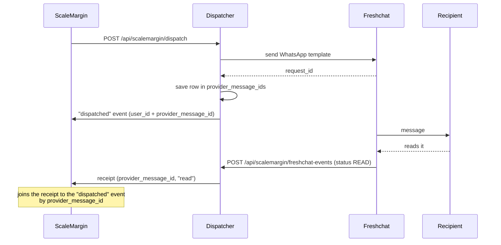

# Message ids & analytics

This doc covers two things:

1. **`provider_message_ids`**: a table in the dispatcher's database. It records which message went to which user.
2. **Analytics forwarding**: how delivery, read and click events get from a provider, through the dispatcher, to the ScaleMargin server.

---

## 1. `provider_message_ids`

The dispatcher writes one row for every WhatsApp message a provider accepts. It never reads the table back. The table is there for the company running the dispatcher to query directly, for example to poll Freshchat for a message's status.

| Column                | Type                          | Notes                                                                         |
| --------------------- | ----------------------------- | ----------------------------------------------------------------------------- |
| `id`                  | `varchar(36)` PK              | Random UUID                                                                   |
| `provider`            | `varchar(32)`                 | `freshchat` \| `gupshup`: the sender that actually delivered, after failover |
| `provider_message_id` | `varchar(191)`                | The provider's id. For Freshchat this is `request_id`                         |
| `user_id`             | `varchar(191)`                | The recipient: the same user id ScaleMargin sent in the dispatch              |
| `sent_at`             | `timestamptz`                 | When the provider accepted it                                                 |

| Index                             | Columns                          | For                                  |
| --------------------------------- | -------------------------------- | ------------------------------------ |
| `provider_message_ids_lookup_idx` | `provider, provider_message_id`  | "Who was this message sent to?"      |
| `provider_message_ids_user_idx`   | `user_id`                        | "Which messages did this user get?"  |
| `provider_message_ids_sent_at_idx`| `sent_at`                        | The retention sweep                  |

**Written when:** the provider accepts the send. Rejected sends have no id, so they are skipped. Rows are inserted in one batch at the end of each dispatch. A failed insert is logged and never fails the send.

**Deleted when:** a row is older than `dispatcher.retention.message_id_ttl`. This setting is **mandatory** and the dispatcher won't start without it. The sweep runs hourly, so a row can outlive the window by up to one hour.

```yaml
dispatcher:
  retention:
    message_id_ttl: "5d 2h"   # d / h / m, minimum 1h
```

```sql
-- Every message a user was sent
SELECT provider, provider_message_id, sent_at
FROM provider_message_ids
WHERE user_id = 'u_42'
ORDER BY sent_at DESC;

-- Who a Freshchat id belongs to
SELECT user_id, sent_at
FROM provider_message_ids
WHERE provider = 'freshchat' AND provider_message_id = 'req_abc123';
```

---

## 2. Analytics forwarding

Yes, your understanding is right, with one clarification. **Nobody pushes analytics to the dispatcher through an API.** Events come from only three sources, and the dispatcher forwards all of them to the ScaleMargin server:

| Source                  | How it reaches the dispatcher                        | Examples                             |
| ----------------------- | ---------------------------------------------------- | ------------------------------------ |
| **The send itself**     | Internal: emitted at the moment of sending           | `dispatched`, `failed`               |
| **Provider webhooks**   | The provider POSTs to the dispatcher                 | `delivered`, `read`, `opened`, `bounced` |
| **The unsubscribe link**| The recipient submits `POST /api/unsubscribe`        | `unsubscribed`                       |



### 2.1 Inbound: provider → dispatcher

Set the webhook URL in each provider's console:

| Provider  | Endpoint                                                          | Authentication                                                           |
| --------- | ----------------------------------------------------------------- | ------------------------------------------------------------------------ |
| Freshchat | `POST /api/scalemargin/freshchat-events` (alias `…/freshchat-notifications`) | `FRESHCHAT_WEBHOOK_SECRET`, sent as a Bearer token or as an HMAC in `X-Freshchat-Signature` |
| Gupshup   | `POST /api/scalemargin/gupshup-events`                            | `GUPSHUP_WEBHOOK_SECRET` HMAC, plus the `smsign_` stamp echoed back       |
| SendGrid  | `POST /api/scalemargin/sendgrid-events`                           | ECDSA, `SENDGRID_EVENT_WEBHOOK_PUBLIC_KEY`                               |
| SES       | `POST /api/scalemargin/ses-notifications`                         | SNS signature                                                            |

A Freshchat status webhook, as the dispatcher receives it:

```json
{
  "event_type": "outbound_message_event",
  "event_time": 1790229587236,
  "account_id": "…",
  "data": { "request_id": "req_abc123", "status": "READ" }
}
```

How Freshchat statuses map to events:

| Freshchat                                          | Event        |
| -------------------------------------------------- | ------------ |
| `ACCEPTED` `SUBMITTED` `QUEUED` `ENQUEUED` `SENT`  | `dispatched` |
| `DELIVERED`                                        | `delivered`  |
| `READ` `SEEN`                                      | `read`       |
| `FAILED` `UNDELIVERED` `REJECTED`                  | `bounced`    |
| `CLICKED`                                          | `clicked`    |
| anything else                                      | dropped      |

What the dispatcher replies to the provider:

| Status | Body                                               | When                               |
| ------ | -------------------------------------------------- | ---------------------------------- |
| `200`  | `{ "received": true, "count": 0, "receipts": 1 }`  | Accepted                           |
| `200`  | `{ "received": true, "forwarded": false }`         | Freshchat or Gupshup disabled in `events:` |
| `401`  | `{ "error": "invalid signature" }`                 | Signature check failed             |
| `400`  | `{ "error": "invalid webhook payload" }`           | Body could not be parsed           |
| `404`  | `{ "error": "not found" }`                         | SendGrid or SES disabled           |

### 2.2 Outbound: dispatcher → ScaleMargin

Every request is a signed JSON `POST`:

```http
POST /api/webhooks/campaign-analytics
Content-Type: application/json
X-ScaleMargin-Signature: sha256=<hex HMAC-SHA256 of the raw body>
X-ScaleMargin-Timestamp: 2026-09-24T10:15:02.114Z
```

The HMAC key is `scalemargin.analytics_secret`. The two payload shapes are below.

**A. Event batch.** Used for dispatch results, email events and unsubscribes. Events are grouped per campaign and organization:

```json
{
  "campaign_id": "cmp_123",
  "organization_id": "org_9",
  "events": [
    {
      "user_id": "u_42",
      "event": "dispatched",
      "timestamp": "2026-09-24T10:15:02.000Z",
      "channel": "whatsapp",
      "idempotency_key": "9f2c4e…",
      "metadata": {
        "user_id": "u_42",
        "campaign_id": "cmp_123",
        "organization_id": "org_9",
        "channel": "whatsapp",
        "provider": "freshchat",
        "provider_message_id": "req_abc123",
        "sender_id": "freshchat_918306107771",
        "sign": "…"
      }
    }
  ]
}
```

- `event` is one of: `dispatched` `sent` `delivered` `read` `opened` `clicked` `bounced` `deferred` `expired` `failed` `complained` `unsubscribed` `preference_update`.
- `idempotency_key` is only present when `events.delivery_mode` is `at_least_once`, which is the default. Deduplicate on it.
- `metadata` has personal data stripped out before it is sent.

**B. WhatsApp receipts.** Freshchat and Gupshup delivery receipts carry no campaign or user id. They arrive keyed only by the provider's id:

```json
{
  "channel": "whatsapp",
  "receipts": [
    {
      "external_id": "req_abc123",
      "event": "read",
      "occurred_at": "2026-09-24T10:17:40.000Z",
      "provider": "freshchat",
      "cause": "…",
      "error_code": "…"
    }
  ]
}
```

`cause` and `error_code` only appear on failures. The server matches `external_id` against `metadata.provider_message_id` from the earlier `dispatched` event. The dispatcher side has the same join: `provider_message_ids.user_id`.

**Where the requests are sent**

| Payload  | Destination, in priority order                                                                                                  |
| -------- | ------------------------------------------------------------------------------------------------------------------------------- |
| Events   | 1. `analytics_callback_url` from the dispatch request<br>2. the campaign registry<br>3. `scalemargin.analytics_callback_url` |
| Receipts | 1. `scalemargin.analytics_callback_url`<br>2. a built-in default (**the dev backend**)                                       |

For events, setting `SCALEMARGIN_ANALYTICS_CALLBACK_URL_OVERRIDES_DISPATCH=true` moves `analytics_callback_url` to the top of that list.

In production, destinations must be HTTPS, must not be private IPs, and the path must contain `/api/webhooks/campaign-analytics`.

**What the dispatcher expects back**

| Response              | Events                                                                   | Receipts                           |
| --------------------- | ------------------------------------------------------------------------ | ---------------------------------- |
| `2xx`                 | Done                                                                     | Done                               |
| `4xx` (except `429`)  | Permanent. Not retried                                                   | Permanent. Not retried             |
| `5xx`, `429`, timeout | Retried from the database outbox: 30s, doubling up to 60 min, 10 attempts (`DISPATCHER_OUTBOX_MAX_ATTEMPTS`) | 3 in-memory retries (100, 200, 400 ms), then dropped |

The response body is ignored.

**Verifying on the ScaleMargin side**

```ts
import { createHmac, timingSafeEqual } from "node:crypto";

function verify(rawBody: Buffer, header: string, secret: string): boolean {
  const expected = createHmac("sha256", secret).update(rawBody).digest("hex");
  const got = header.replace(/^sha256=/, "");
  return got.length === expected.length &&
    timingSafeEqual(Buffer.from(got, "hex"), Buffer.from(expected, "hex"));
}
```

Always compute the HMAC over the **raw** request body, never over re-serialized JSON.

---

## Known gaps

- **No `FRESHCHAT_WEBHOOK_SECRET` means no authentication.** Without the secret, the Freshchat endpoint accepts any caller. Set the secret in production.
- **Receipts are not durable.** They skip the outbox. If ScaleMargin is down for more than about a second, those receipts are lost. The `provider_message_ids` table still lets you poll Freshchat for them.
- **The receipt default URL points at dev.** If `scalemargin.analytics_callback_url` is not set, a production dispatcher sends receipts to `dev.scalemargins.tech`.
- **The timestamp is not signed.** `X-ScaleMargin-Timestamp` is not part of the HMAC, so it gives no replay protection. Deduplicate on `idempotency_key`.
