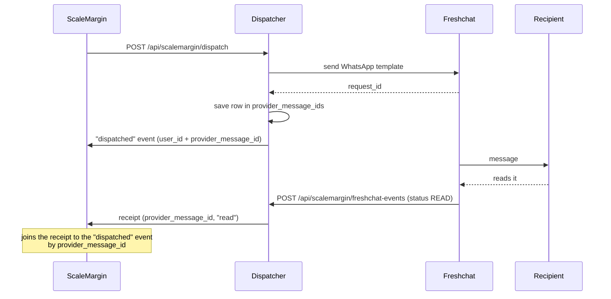

# Message ids & analytics

This doc covers two things:

1. **`provider_message_ids`**: a table in the dispatcher's database. It records which message went to which user.
2. **Analytics forwarding**: how delivery, read and click events get from a provider, through the dispatcher, to the ScaleMargin server.

---

## 1. `provider_message_ids`

The dispatcher writes one row for every WhatsApp message a provider accepts. You can query it directly ("who was this message sent to?"), and the Freshchat status poller (§1.1) reads it to know what to poll.

| Column                | Type                          | Notes                                                                         |
| --------------------- | ----------------------------- | ----------------------------------------------------------------------------- |
| `id`                  | `varchar(36)` PK              | Random UUID                                                                   |
| `provider`            | `varchar(32)`                 | `freshchat` \| `gupshup`: the sender that actually delivered, after failover |
| `provider_message_id` | `varchar(191)`                | The provider's id. For Freshchat this is `request_id`                         |
| `user_id`             | `varchar(191)`                | The recipient: the same user id ScaleMargin sent in the dispatch              |
| `sent_at`             | `timestamptz`                 | When the provider accepted it                                                 |
| `sender_id`           | `varchar`, nullable           | The `senders:` id that sent it                                                |
| `status`              | `varchar(32)`, nullable       | Last raw provider status seen by the poller (`DELIVERED`, `READ`, …)          |
| `status_event`        | `varchar(16)`, nullable       | Last status **reported to ScaleMargin** (`delivered`, `read`, `bounced`, …)   |
| `status_at`           | `timestamptz`, nullable       | When `status_event` was reported                                              |
| `provider_ref`        | `varchar`, nullable           | Freshchat's own `message_id`                                                  |
| `next_poll_at`        | `timestamptz`, nullable       | When the poller checks next. `NULL` = not polled (poller off, final, or TTL)  |
| `last_polled_at`      | `timestamptz`, nullable       | Last status API call                                                          |
| `poll_attempts`       | `int`, default 0              | Status API calls made for this row                                            |
| `poll_error`          | `varchar(255)`, nullable      | Last poll problem, e.g. `freshchat_status_poll_ttl reached`, `forward failed: …`        |

| Index                             | Columns                          | For                                  |
| --------------------------------- | -------------------------------- | ------------------------------------ |
| `provider_message_ids_lookup_idx` | `provider, provider_message_id`  | "Who was this message sent to?"      |
| `provider_message_ids_user_idx`   | `user_id`                        | "Which messages did this user get?"  |
| `provider_message_ids_sent_at_idx`| `sent_at`                        | The retention sweep                  |
| `provider_message_ids_poll_idx`   | `provider, next_poll_at`         | The status poller's "what is due?"   |

**Written when:** the provider accepts the send. Rejected sends have no id, so they are skipped. Rows are inserted in one batch at the end of each dispatch. A failed insert is logged and never fails the send.

**Deleted when:** a row is older than `dispatcher.retention.message_id_ttl`. This setting is **mandatory** and the dispatcher won't start without it. The sweep runs hourly, so a row can outlive the window by up to one hour.

```yaml
dispatcher:
  retention:
    message_id_ttl: "5d 2h"   # d / h / m, minimum 1h
```

```sql
-- Every message a user was sent
SELECT provider, provider_message_id, sent_at
FROM provider_message_ids
WHERE user_id = 'u_42'
ORDER BY sent_at DESC;

-- Who a Freshchat id belongs to
SELECT user_id, sent_at
FROM provider_message_ids
WHERE provider = 'freshchat' AND provider_message_id = 'req_abc123';
```

### 1.0 Saved API response values (`api_response_refs`)

A sibling table, written when an api variable has `save_response` — values from
its response kept against the Freshchat `request_id` the message went out with,
with the campaign, template, sender and organization. Pruned on the same
`message_id_ttl`. Details: `docs/variables-system-and-lookup-fields.md` §5.1.

### 1.0.1 Client events — `POST /api/scalemargin/client-events`

Your own systems can report what happened to a sent WhatsApp message (a click
on your site, a read seen in your app). Off (404) until
`events.client_webhook_secret` is set; authenticated with
`Authorization: Bearer <secret>` or `X-ScaleMargin-Signature: sha256=<HMAC-SHA256 of the raw body>`.

Body: one event, an array, or `{ "events": [...] }` — at most 500.

| Field | |
|---|---|
| `event` | `delivered`, `read`, `clicked` or `failed` (Freshchat statuses like `READ` work too). `dispatched` is refused |
| `occurred_at` | ISO 8601; default now |
| `request_id` | The Freshchat `request_id` — **or** name it by a saved value: |
| `variable_name` + `path` + `value` | A row of `api_response_refs` |
| `user_id`, `campaign_id`, `organization_id`, `dispatch_id` | Narrow a value sent with more than one message; `user_id` also checks a `request_id` |
| `cause`, `error_code` | Kept on `failed` |

The other columns of an `api_response_refs` row may be sent back as-is and are
ignored. Each event is forwarded to ScaleMargin as a Freshchat receipt for its
message — skipped steps are filled in (`clicked` also reports `delivered` and
`read` if they never were) and nothing already reported is sent twice.

Response `200 { received, receipts, results: [{ index, status, request_id?, error? }] }`
with `status` = `forwarded` · `already_reported` · `not_found` · `ambiguous`
(add `user_id` / `campaign_id` / `dispatch_id`) · `invalid`. `401` wrong secret,
`413` over 500 events, `502 { retryable: true }` if ScaleMargin did not accept
them — retry the batch.

### 1.1 Freshchat status poller

For deployments that can't register a Freshchat webhook. Off by default, per sender:

```yaml
senders:
  - id: freshchat-main
    provider: freshchat
    freshchat:
      # …
      status_poller: true                # default false
      status_poll_interval_seconds: 10   # default 10, min 5, max 3600
dispatcher:
  retention:
    freshchat_status_poll_ttl: "3d"                # default 3d, capped at message_id_ttl
```

- Each send from a poller-enabled sender gets `next_poll_at`. Every interval the poller calls `GET https://<org>.freshchat.com/v2/outbound-messages?request_id=<id>` (host taken from the sender's `template_api_url`) for up to 200 due rows, 4 at a time.
- Only **forward progress** is forwarded: dispatched → delivered → read / bounced → clicked. A change goes to ScaleMargin through the same signed receipt path as the Freshchat webhook, then `status_event` is saved.
- **No skipped steps:** statuses climb `dispatched → delivered → read → clicked`. If a message moves more than one step between two polls (delivered and read inside one interval), every step it passed is reported, in order — `read` seen first also sends `delivered`, 1 ms earlier. A failure (`bounced`) implies nothing. The Freshchat webhook applies the same rule.
- **Webhook and poller together:** each records what it reported. The poller never re-sends a status the webhook delivered, and the webhook drops a step already reported — e.g. a late real `delivered` after the poller sent it along with `read`. A webhook receipt for a message with no recorded send passes through unchanged.
- **Stops polling** a row at a final status (read, failed, clicked) or once it is older than `freshchat_status_poll_ttl`.
- **Backs off with age:** the interval ×1 for the first 15 min, ×6 up to 2 h, ×30 after that.
- **Errors:** 429 honours `Retry-After`. 401/403 pauses that sender for 5 min with one warning. A 404 or unknown id retries on the next interval. If ScaleMargin refuses a receipt, the change isn't saved and is retried on the next poll.
- The poller assumes **one dispatcher replica**. Two replicas can poll the same row and report one change twice.

---

## 2. Analytics forwarding

Yes, your understanding is right, with one clarification. **Nobody pushes analytics to the dispatcher through an API.** Events come from only three sources, and the dispatcher forwards all of them to the ScaleMargin server:

| Source                  | How it reaches the dispatcher                        | Examples                             |
| ----------------------- | ---------------------------------------------------- | ------------------------------------ |
| **The send itself**     | Internal: emitted at the moment of sending           | `dispatched`, `failed`               |
| **Provider webhooks**   | The provider POSTs to the dispatcher                 | `delivered`, `read`, `opened`, `bounced` |
| **The unsubscribe link**| The recipient submits `POST /api/unsubscribe`        | `unsubscribed`                       |



### 2.1 Inbound: provider → dispatcher

Set the webhook URL in each provider's console:

| Provider  | Endpoint                                                          | Authentication                                                           |
| --------- | ----------------------------------------------------------------- | ------------------------------------------------------------------------ |
| Freshchat | `POST /api/scalemargin/freshchat-events` (alias `…/freshchat-notifications`) | `FRESHCHAT_WEBHOOK_SECRET`, sent as a Bearer token or as an HMAC in `X-Freshchat-Signature` |
| Gupshup   | `POST /api/scalemargin/gupshup-events`                            | `GUPSHUP_WEBHOOK_SECRET` HMAC, plus the `smsign_` stamp echoed back       |
| SendGrid  | `POST /api/scalemargin/sendgrid-events`                           | ECDSA, `SENDGRID_EVENT_WEBHOOK_PUBLIC_KEY`                               |
| SES       | `POST /api/scalemargin/ses-notifications`                         | SNS signature                                                            |

What the dispatcher replies to the provider:

| Status | Body                                               | When                               |
| ------ | -------------------------------------------------- | ---------------------------------- |
| `200`  | `{ "received": true, "count": 0, "receipts": 1 }`  | Accepted                           |
| `200`  | `{ "received": true, "forwarded": false }`         | Freshchat or Gupshup disabled in `events:` |
| `401`  | `{ "error": "invalid signature" }`                 | Signature check failed             |
| `400`  | `{ "error": "invalid webhook payload" }`           | Body could not be parsed           |
| `404`  | `{ "error": "not found" }`                         | SendGrid or SES disabled           |

### 2.2 Pushing an event by hand

Everything below is exactly what each endpoint accepts. Use it to replay an event, test locally, or push a status from your own system.

**Pushable by hand:** Freshchat, Gupshup and the unsubscribe link.

**Not pushable by hand:**
- **SendGrid:** each request must carry an ECDSA signature made with SendGrid's private key.
- **SES:** each request must carry an SNS signature backed by an AWS certificate.

For those two, replay from the provider's own console.

**Two ways an event is matched to a recipient.** Every body below takes one of these two forms:

| Form | What you send | What the dispatcher forwards to ScaleMargin |
| --- | --- | --- |
| **Receipt** | Only the provider message id and a status | A receipt (2.3 B). ScaleMargin matches it to the recipient by message id |
| **Correlated** | The message id and status, plus a `tag` holding `campaign_id`, `user_id` and `organization_id` | A full event (2.3 A) |

Correlated works for Freshchat and Gupshup alike.

---

#### Freshchat

```http
POST /api/scalemargin/freshchat-events
Content-Type: application/json
Authorization: Bearer <FRESHCHAT_WEBHOOK_SECRET>
```

Authentication works one of three ways:

| Setup | Header to send |
| --- | --- |
| Bearer token | `Authorization: Bearer <FRESHCHAT_WEBHOOK_SECRET>` |
| HMAC | `X-Freshchat-Signature: sha256=<hex HMAC-SHA256 of the raw body, keyed with the secret>` |
| No secret configured | No header; the endpoint is open |

`/api/scalemargin/freshchat-notifications` is an alias for the same endpoint.

**Receipt**, in Freshchat's own webhook shape:

```json
{
  "event_type": "outbound_message_event",
  "event_time": 1790229587236,
  "data": {
    "request_id": "req_abc123",
    "status": "READ"
  }
}
```

- `event_time` is in epoch **milliseconds**. If it's missing, the dispatcher uses the time it received the event.
- A flat body also works: `{ "request_id": "req_abc123", "status": "READ", "timestamp": "2026-09-24T10:17:40Z" }`.
- On a failure, add `"failure_reason"` and `"failure_code"` inside `data`.
- To send several events at once, send an array of these objects.

**Correlated:** add a `tag` to the same body:

```json
{
  "request_id": "req_abc123",
  "status": "DELIVERED",
  "tag": { "campaign_id": "cmp_123", "user_id": "u_42", "organization_id": "org_9" }
}
```

| `status` (any case)                                | Becomes      |
| -------------------------------------------------- | ------------ |
| `ACCEPTED` `SUBMITTED` `QUEUED` `ENQUEUED` `SENT`  | `dispatched` |
| `DELIVERED`                                        | `delivered`  |
| `READ` `SEEN`                                      | `read`       |
| `FAILED` `UNDELIVERED` `REJECTED`                  | `bounced`    |
| `CLICKED`                                          | `clicked`    |
| anything else                                      | ignored      |

**Response:** `200 { "received": true, "count": 0, "receipts": 1 }`.
- `count` is how many correlated events were forwarded.
- `receipts` is how many receipts were forwarded.

---

#### Gupshup

```http
POST /api/scalemargin/gupshup-events
Content-Type: application/json
X-Gupshup-Signature: <hex HMAC-SHA256 of the raw body, keyed with the webhook secret>
```

or, for Gupshup's own delivery callbacks (they cannot sign a body), the secret
as a token on the callback URL:

```http
POST /api/scalemargin/gupshup-events?token=<the webhook secret>
```

Either proof is accepted. The secret is the Gupshup sender's `webhook_secret`
(or `GUPSHUP_WEBHOOK_SECRET`). With no secret set the endpoint is open — boot
warns — and only receipts echoing a valid `smsign_` stamp are forwarded.

To close it: generate a secret (`openssl rand -hex 32`), set it as
`webhook_secret` on the Gupshup sender, and set Gupshup's delivery-report
callback URL to `https://<dispatcher>/api/scalemargin/gupshup-events?token=<secret>`
— **both, then restart**. Setting only the secret rejects every receipt until
the callback URL carries the token. The token is in the URL, so keep proxy
access logs that record query strings private; the dispatcher never logs it.

**Receipt**, in Gupshup Enterprise's delivery-report shape. It's always a JSON array:

```json
[
  {
    "externalId": "4012345678901234567",
    "eventType": "DELIVERED",
    "eventTs": 1790229587236,
    "extra": "smsign_<32 hex>"
  }
]
```

- `extra` is **required**. A receipt without an `smsign_` value is dropped: the response is still `200`, with `"receipts": 0`.
- `smsign_` is the first 32 hex characters of `HMAC-SHA256(analytics_secret, "campaign_id|user_id|organization_id")`. The dispatcher attaches it to every Gupshup send, and Gupshup echoes it back.
- `eventTs` is in epoch milliseconds.
- On a failure, add `"cause"` and `"errorCode"`.

**Correlated** (no `smsign_` needed):

```json
{
  "msgId": "4012345678901234567",
  "eventType": "delivered",
  "timestamp": "2026-09-24T10:17:40Z",
  "tag": "{\"campaign_id\":\"cmp_123\",\"user_id\":\"u_42\",\"organization_id\":\"org_9\"}"
}
```

`tag` can be a JSON string, as Gupshup sends it, or a plain object.

| `eventType` (any case)  | Becomes      |
| ----------------------- | ------------ |
| `enqueued` `sent`       | `dispatched` |
| `delivered`             | `delivered`  |
| `read`                  | `opened`     |
| `clicked`               | `clicked`    |
| `failed`                | `failed`     |
| anything else           | ignored      |

**Response:** same as Freshchat.

---

#### Unsubscribe link

This is the form behind the link in every email. It has no authentication, because the recipient's browser posts it.

```http
POST /api/unsubscribe
Content-Type: application/x-www-form-urlencoded

uid=u_42&campaign_id=cmp_123&organization_id=org_9&reason=too_frequent
```

| Field | Required | Notes |
| --- | --- | --- |
| `uid` | yes | The user id |
| `campaign_id`, `organization_id` | to forward | Without both, the unsubscribe is saved in the dispatcher's own database but never forwarded to ScaleMargin |
| `reason` | yes | A reason id from `links.unsubscribe_reasons` |
| `reason_other` | no | Free text, used when the reason is `other` |

The event goes to `links.unsubscribe_analytics_url` as `unsubscribed`, with `provider: "link_click"`.

**Response:**

| Status | When |
| --- | --- |
| `302` | Recorded, and `links.unsubscribe_redirect_url` is set: the browser is sent there |
| `200` | Recorded, and no redirect URL is set: a confirmation page is shown |
| `400` | `uid` or `reason` is missing |

---

#### SendGrid and SES: what they send

These are shown for reference only; you can't forge them.

| | SendGrid | SES |
| --- | --- | --- |
| Endpoint | `POST /api/scalemargin/sendgrid-events` | `POST /api/scalemargin/ses-notifications` |
| Auth | `X-Twilio-Email-Event-Webhook-Signature` + `…-Timestamp` (ECDSA) | SNS envelope, signed by AWS |
| Body | JSON array of events | SNS envelope; the SES event is inside the `Message` string |
| Recipient comes from | `custom_args.{campaign_id,user_id,organization_id}` | `mail.tags.{campaign_id,user_id,organization_id}` |
| Rejected | `401 invalid signature` | `401 invalid SNS signature`, `400 Invalid JSON` |

Status mapping:
- **SendGrid:**
  - `processed` → `dispatched`
  - `delivered` → `delivered`
  - `open` → `opened`
  - `click` → `clicked`
  - `bounce` and `dropped` → `bounced`
  - `deferred` → `deferred`
  - `spamreport` → `complained`
  - `unsubscribe` and `group_unsubscribe` → `unsubscribed`
- **SES:**
  - `Send` → `dispatched`
  - `Delivery` → `delivered`
  - `Open` → `opened`
  - `Click` → `clicked`
  - `Bounce` and `Reject` → `bounced`
  - `Complaint` → `complained`
  - `Subscription` → `unsubscribed`

The SES endpoint also accepts SNS `SubscriptionConfirmation` messages and confirms them automatically, but only if the `SubscribeURL` is on an `amazonaws.com` host.

### 2.3 Outbound: dispatcher → ScaleMargin

Every request is a signed JSON `POST`:

```http
POST /api/webhooks/campaign-analytics
Content-Type: application/json
X-ScaleMargin-Signature: sha256=<hex HMAC-SHA256 of the raw body>
X-ScaleMargin-Timestamp: 2026-09-24T10:15:02.114Z
```

The HMAC key is `scalemargin.analytics_secret`. The two payload shapes are below.

**A. Event batch.** Used for dispatch results, email events and unsubscribes. Events are grouped per campaign and organization:

```json
{
  "campaign_id": "cmp_123",
  "organization_id": "org_9",
  "events": [
    {
      "user_id": "u_42",
      "event": "dispatched",
      "timestamp": "2026-09-24T10:15:02.000Z",
      "channel": "whatsapp",
      "idempotency_key": "9f2c4e…",
      "metadata": {
        "user_id": "u_42",
        "campaign_id": "cmp_123",
        "organization_id": "org_9",
        "channel": "whatsapp",
        "provider": "freshchat",
        "provider_message_id": "req_abc123",
        "sender_id": "freshchat_918306107771",
        "sign": "…"
      }
    }
  ]
}
```

- `event` is one of: `dispatched` `sent` `delivered` `read` `opened` `clicked` `bounced` `deferred` `expired` `failed` `complained` `unsubscribed` `preference_update`.
- `idempotency_key` is only present when `events.delivery_mode` is `at_least_once`, which is the default. Deduplicate on it. Unsubscribe-link events never carry one.
- `metadata` has personal data stripped out before it is sent.

**B. WhatsApp receipts.** Freshchat and Gupshup delivery receipts carry no campaign or user id. They arrive keyed only by the provider's id:

```json
{
  "channel": "whatsapp",
  "receipts": [
    {
      "external_id": "req_abc123",
      "event": "read",
      "occurred_at": "2026-09-24T10:17:40.000Z",
      "provider": "freshchat",
      "cause": "…",
      "error_code": "…"
    }
  ]
}
```

`cause` and `error_code` only appear on failures.

Freshchat receipts carry `"provider": "freshchat"`. Gupshup receipts have no `provider` field; they carry `sign` instead, which your server can recompute to confirm the message was ours. The server matches `external_id` against `metadata.provider_message_id` from the earlier `dispatched` event. The dispatcher side has the same join: `provider_message_ids.user_id`.

**Where the requests are sent**

| Payload  | Destination, in priority order                                                                                                  |
| -------- | ------------------------------------------------------------------------------------------------------------------------------- |
| Events   | 1. `analytics_callback_url` from the dispatch request<br>2. the campaign registry<br>3. `scalemargin.analytics_callback_url` |
| Receipts | 1. `scalemargin.analytics_callback_url`<br>2. a built-in default (**the dev backend**)                                       |

For events, setting `SCALEMARGIN_ANALYTICS_CALLBACK_URL_OVERRIDES_DISPATCH=true` moves `analytics_callback_url` to the top of that list.

In production, destinations must be HTTPS, must not be private IPs, and the path must contain `/api/webhooks/campaign-analytics`.

**What the dispatcher expects back**

| Response              | Events                                                                   | Receipts                           |
| --------------------- | ------------------------------------------------------------------------ | ---------------------------------- |
| `2xx`                 | Done                                                                     | Done                               |
| `4xx` (except `429`)  | Permanent. Not retried                                                   | Permanent. Not retried             |
| `5xx`, `429`, timeout | Retried from the database outbox: 30s, doubling up to 60 min, 10 attempts (`DISPATCHER_OUTBOX_MAX_ATTEMPTS`) | 3 in-memory retries (100, 200, 400 ms), then dropped |

The response body is ignored.

**Verifying on the ScaleMargin side**

```ts
import { createHmac, timingSafeEqual } from "node:crypto";

function verify(rawBody: Buffer, header: string, secret: string): boolean {
  const expected = createHmac("sha256", secret).update(rawBody).digest("hex");
  const got = header.replace(/^sha256=/, "");
  return got.length === expected.length &&
    timingSafeEqual(Buffer.from(got, "hex"), Buffer.from(expected, "hex"));
}
```

Always compute the HMAC over the **raw** request body, never over re-serialized JSON.
