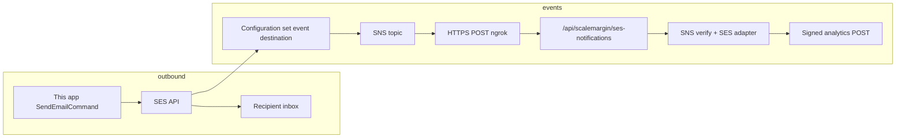

# Amazon SES — configure, publish events, and test (this repo)

This guide walks through **sending** with SES (message tags + configuration set) and **receiving** bounce/complaint/delivery/open/click/**subscription** events via **Amazon SNS** into `POST /api/scalemargin/ses-notifications`, then forwarding **HMAC-signed** analytics like the SendGrid path.

For a one-command local smoke test (SQLite users, temp `events.yaml`, real SES sends, CSV capture), use:

```bash
export EVENT_TEST_PUBLIC_BASE_URL=https://<your-ngrok-host>.ngrok-free.app
pnpm run dev:ses-event-test
```

Prerequisites mirror SendGrid’s dual-secret test: [`event-dual-secret-local-test.md`](event-dual-secret-local-test.md) (ngrok, `EVENT_TEST_RECIPIENTS`, `SCALEMARGIN_*` secrets).

---

## What you are wiring together



- **Outbound:** `SESProvider` sets **`ConfigurationSetName`** from `SES_EVENT_CONFIG_SET` and adds **message tags** `campaign_id`, `user_id`, `organization_id` (≤256 chars each). Tags appear on SNS events as `mail.tags`.
- **Inbound:** SES publishes JSON to **SNS**. SNS wraps it in an outer envelope (`Type`, `Message`, signatures). This app verifies the **SNS** signature, then parses the inner SES event. **`analytics_callback_url`** is too long for tags; dispatch registers **`registerCampaignCallback`** so SES events resolve the ScaleMargin URL from **`campaign_id`**. If the process restarts before delayed events arrive, the in-memory registry is empty — set optional **`SCALEMARGIN_ANALYTICS_CALLBACK_URL`** to your platform **`/api/webhooks/campaign-analytics`** URL (same rules as `validateCallbackUrl`) so events still forward.

---

## Environment variables (`.env`)

| Variable | Purpose |
|----------|---------|
| `EMAIL_PROVIDER` | Set to **`ses`** for SES sends. |
| `AWS_REGION` | SES region (e.g. `us-east-1`) — must match where identities and configuration set live. |
| `AWS_ACCESS_KEY_ID` / `AWS_SECRET_ACCESS_KEY` | IAM user keys (local dev) or omit on AWS compute with an **instance/task role** that allows `ses:SendEmail`. |
| `FROM_EMAIL` | Verified **domain** or **email** identity in SES. |
| `SES_EVENT_CONFIG_SET` | **Name** of the SES **Configuration set** that owns your event destination (must match console exactly). |
| `SCALEMARGIN_DISPATCH_SECRET` | Verifies `POST /api/scalemargin/dispatch`. |
| `SCALEMARGIN_ANALYTICS_SECRET` | Signs outbound analytics POSTs. |
| `SCALEMARGIN_ANALYTICS_CALLBACK_URL` | Optional **fallback** when SES events have no per-campaign callback in memory (e.g. after restart). Must include `/api/webhooks/campaign-analytics`; org/campaign still come from signed payload. |
| `EVENT_TEST_PUBLIC_BASE_URL` | **HTTPS** tunnel origin for `metadata.analytics_callback_url` in generated dispatch (required for SNS to reach you). |
| `EVENT_TEST_RECIPIENTS` | Comma-separated test inboxes. In SES **sandbox**, each must be **verified** in SES. |
| `EVENT_TEST_CSV_PATH` | Optional override for CSV path when using `dev:ses-event-test` (script sets a default; see script header for `SES_EVENT_TEST_CSV_PATH`). |
| `UNSUBSCRIBE_URL_BASE` / `UNSUBSCRIBE_LINK_ANALYTICS_URL` | Same pattern as SendGrid test — optional **GET `/api/unsubscribe`** double proxy. |

Event pipeline: generated temp `events.yaml` enables **SES** and disables SendGrid for `pnpm run dev:ses-event-test`. For normal `pnpm run dev`, copy [`config/events.example.yaml`](../config/events.example.yaml) → `config/events.yaml` and set `providers.ses.enabled: true`.

---

## AWS console checklist (every step)

### 1. Account and region

- Pick a **region** in the console (e.g. **N. Virginia**). SES and SNS resources for this flow should live in that region.
- Note: **SES sending** can be in one region while you test; configuration set and SNS topic must align with where you send from this app (`AWS_REGION`).

### 2. Verified identity (sender + sandbox recipients)

- **SES → Verified identities → Create identity** — verify your **domain** (recommended) or a single **email** for `FROM_EMAIL`.
- If your account is in the **SES sandbox**, for each address in `EVENT_TEST_RECIPIENTS` go to **Verified identities** and verify those emails too (SES only delivers to verified addresses in sandbox).

### 3. Configuration set (name = `SES_EVENT_CONFIG_SET`)

- **SES → Configuration sets → Create configuration set**.
- **Name:** copy into `.env` as `SES_EVENT_CONFIG_SET` (e.g. `scalemargin-events-dev`).

### 4. Event destination → Amazon SNS

- Open the configuration set → **Event destinations → Add destination**.
- **Event types** — enable what you need (aligns with the AWS UI “Select event types” screen):

  | Group | Recommended for this reference app |
  |-------|------------------------------------|
  | **Sending and delivery** | **Sends** (maps to `dispatched`), **Deliveries**, **Hard bounces**, **Complaints**, **Delivery delays** (optional), **Rendering failures** (optional), **Rejects** (optional) |
  | **Subscriptions** | Enable **Subscriptions** to receive **list-unsubscribe / preference** events (mapped to analytics **`unsubscribed`** with `metadata.unsubscribe_source: ses_subscription`). |
  | **Open and click tracking** | **Opens**, **Clicks** if you enabled [virtual deliverability](https://docs.aws.amazon.com/ses/latest/dg/faqs-metrics.html) / engagement tracking in SES and want those events. |

- **Destination type:** **Amazon SNS**.
- **SNS topic:** create a new topic or choose an existing one (same account/region). Finish creating the destination.

### 5. SNS topic subscription (HTTPS to this app)

- Open **Amazon SNS → Topics → (your topic) → Create subscription**.
- **Protocol:** `HTTPS`
- **Endpoint:** `https://<your-ngrok-host>/api/scalemargin/ses-notifications`  
  (no trailing slash issues — use the exact public URL; run `ngrok http <PORT>` to match `PORT` in `.env`.)

- **Confirm subscription:** SNS sends a **`SubscriptionConfirmation`** POST to your endpoint. This server validates the SNS signature and, if `SubscribeURL` is on `*.amazonaws.com`, **GETs** that URL to confirm automatically. Watch server logs for `[SES-SNS] Subscription confirmed`.

- If confirmation fails, check: tunnel up, path correct, **HTTP** vs **HTTPS** (use HTTPS for SNS in production-like tests), and that the first POST reaches your app (ngrok inspector).

### 6. Allow SES to publish to the topic

- When you create the event destination **from the SES wizard**, AWS often attaches a policy so **SES can publish** to the topic.
- If events never arrive, in **SNS → Topic → Access policy**, ensure SES is allowed to `SNS:Publish` for `ses.amazonaws.com` source (see [AWS documentation](https://docs.aws.amazon.com/ses/latest/dg/event-publishing-faq.html)).

### 7. Optional: default configuration set

- You can set this configuration set as the **account default** for SES v2, but this app **already** passes **`ConfigurationSetName`** on each `SendEmail` when `SES_EVENT_CONFIG_SET` is set — that is the critical link.

---

## Run the automated SES smoke test

```bash
# In .env: SCALEMARGIN_* , FROM_EMAIL, SES_EVENT_CONFIG_SET, AWS_REGION, credentials,
# EVENT_TEST_RECIPIENTS, EVENT_TEST_PUBLIC_BASE_URL=https://<ngrok>...

ngrok http 3100   # or your PORT

pnpm run dev:ses-event-test
```

The script:

1. Builds a temp SQLite DB + `dispatch.yaml` + `events.yaml` (SES on, SendGrid off).
2. Sets `EVENT_TEST_CSV_PATH` default to `./data/ses-event-test-capture.csv` (override with `SES_EVENT_TEST_CSV_PATH`).
3. Spawns the real app and (by default) POSTs dispatch to localhost so **real** SES sends run with **message tags** and your configuration set.
4. Writes a stable dispatch JSON at **`data/ses-event-test-dispatch-payload.json`** and prints a **curl** for retries.

After SNS delivers events to your tunnel, you should see new rows in the CSV (and `[Events][PreferenceSimulation]` lines for `unsubscribed` / `complained` unless `EVENT_PREFERENCE_SIMULATION_LOG=0`).

---

## API routes (reference)

| Method | Path | Role |
|--------|------|------|
| `POST` | `/api/scalemargin/dispatch` | Campaign send (tags + configuration set applied for SES). |
| `POST` | `/api/scalemargin/ses-notifications` | **SNS** → inner SES event → analytics. |
| `GET` | `/api/unsubscribe` | Optional browser unsubscribe link (see [`sendgrid.readme.md`](sendgrid.readme.md) / dispatch placeholders). |

---

## Troubleshooting

| Symptom | What to check |
|---------|----------------|
| **MessageRejected** / “Email address not verified” | Sandbox: verify **recipient** addresses. |
| **ConfigurationSetDoesNotExist** | `SES_EVENT_CONFIG_SET` string matches the console set name; region matches. |
| **“The security token included in the request is invalid”** on send | Almost always **wrong access key + secret pair** or **credentials not loaded**: `pnpm dev` / `pnpm start` now load repo-root **`.env`** automatically (see `src/index.ts`). Still check **non-empty shell exports** (`echo $AWS_ACCESS_KEY_ID`) — they override `.env`. **Duplicate keys in `.env`**: last line wins. Confirm with `aws sts get-caller-identity`. |
| **401** on `/api/scalemargin/ses-notifications` | SNS signature verification failed — body must be the **raw** POST string SNS sent; do not parse/re-stringify in a proxy. |
| No events in CSV | SNS subscription **confirmed**? Event destination uses the **same** topic you subscribed? Configuration set attached to the **messages you send**? |
| **`dispatched` in CSV but nothing from SES (no `delivered`, etc.)** | `dispatched` is emitted **inside this app** after `SendEmail` succeeds. **`delivered` / bounces / complaints** only arrive when **SES publishes to SNS** and SNS POSTs to `/api/scalemargin/ses-notifications`. Fix the SNS subscription + event destination (same region, same configuration set name as `SES_EVENT_CONFIG_SET`). |
| **No `opened` / `clicked` rows** | SES is **not** SendGrid: it does **not** inject a tracking pixel or rewrite links unless **[engagement tracking](https://docs.aws.amazon.com/ses/latest/dg/vdm-get-started.html)** (Virtual Deliverability Manager) is **on** for your account or for **this configuration set** (`PutConfigurationSetVdmOptions` → `EngagementMetrics: ENABLED`). Without that, SES never records opens/clicks, so SNS has nothing to publish. Also: in the configuration set’s **event destination**, enable **Opens** and **Clicks**; the recipient must **load images** (open pixel) and use **wrapped** links for clicks. |
| **Subscription** events missing | In the configuration set destination, enable **Subscriptions** (see table above). |
| Tags missing on events | Dispatch must include `message.context` (this app does from ScaleMargin dispatch); `SES_EVENT_CONFIG_SET` must be set at send time. |

---

## Code and tests

| Path | Role |
|------|------|
| `src/providers/ses.ts` | `SendEmail` + configuration set + tags. |
| `src/events/outbound/ses-tagger.ts` | Tag names and `ConfigurationSetName`. |
| `src/events/adapters/ses.ts` | SNS parse, PII strip, `Subscription` → `unsubscribed`. |
| `src/index.ts` | Route + SNS subscription confirmation handler. |

```bash
pnpm exec vitest run src/events/adapters/ses.spec.ts src/events/ses.integration.spec.ts
```

---

## Related docs

| Doc | Topic |
|-----|--------|
| [`event-dual-secret-local-test.md`](event-dual-secret-local-test.md) | ngrok, CSV capture, public `analytics_callback_url` |
| [`event-pipeline-contract.md`](event-pipeline-contract.md) | Standardized events, SES correlation |
| [`pii-guarantees.md`](pii-guarantees.md) | Fields stripped from SES payloads |
| [`sendgrid.readme.md`](sendgrid.readme.md) | Parallel provider guide |
